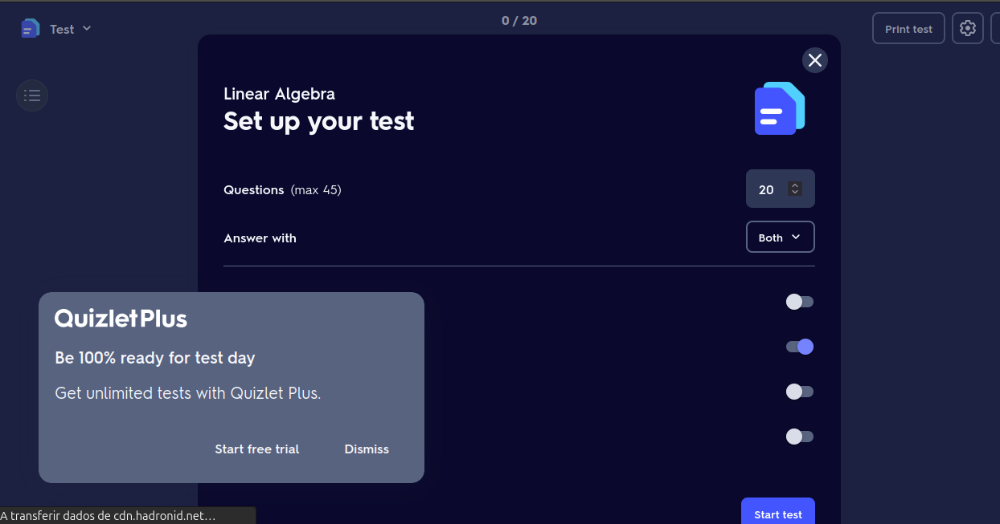
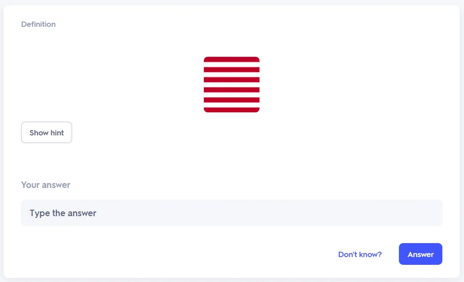

# Competitor Analysis: Quizlet
## General Information 
- **Name of System:** Quizlet
- **Company/Developer:** Quizlet Inc
- **Website/Product Page:** (https://quizlet.com) 
- **Version/Release Date:** January of 2007
- **Platform(s) Supported:** Desktop, Microsoft Windows, Linux, MaxOS, Android, iOS, Web browsers 
- **Target Audience:** Students, Professionals and Teams, Enterprises, Individuals

--- 
## Core Functionality 

**Primary Purpose:** Quizlet is an online learning tool with digital flashcards, quizzes, and study games to help users memorize and review information.

**Key Features:** - Flashcards - Interactive Learning Games - AI Powered Q&A

**Unique Selling Points (USPs):** - Wide Range of Study Tools and Modes 

**Limitations/Weaknesses:** - Limited access to features behind a paywall and restricted functionality without a subscription. Poor support when customizing cards, some cards get cropped when uploading images

---

## Screenshots

Many of the apps useful features are locked behind a paywall!

Some images get cropped automatically, not allowing the user to customize them!

## Online Reviews

PCMAG: "Quizlet is an effective, intuitive tool for learners of all ages who need to memorize information."

LIFEWIRE: "Quizlet offers audio readings and is great for teachers and students who can access a large library or create custom sets."

G2: "All these modes are now behind a paywall, leaving only 'Flashcards' as free."

G2: "Quizlet is now a shadow of its former self, with many features locked behind a paywall."

BBB: "Quizlet makes it impossible to cancel auto-renewal for an unneeded subscription."

LEARNOPOLY: "Quizlet is a great tool for memorization, but it may not be ideal for learning new concepts."

REDDIT USER: "I am working on a deck of cards, and noticed that when studying the deck it always crops the rectangular images into a square." 