[Back to main Logbook Page](../hci_logbook.md)

---

# E. Functional Prototype and Evaluation

# Prototype
## Introduction
        We decided to create an app using Electron, with HTML, CSS, and JavaScript because the Electron environment provides us with access to many Node.js modules that help us recreate the same workspace we had in our low-fidelity prototype.
        We also built a working installer for multiple operating systems by leveraging some of Electron’s additional features. This made development easier, especially since some team members use Windows while others use Linux.
## Tasks
        We implemented the same tasks from the low-fidelity prototype, but with a couple differences.
        We also removed the calendar related task and added a new subtask that allows users to upload a file, rather than just displaying it.
## Notes
        Given our workload and limited time for this project, and even though our app is designed to be “all-in-one”, we chose not to implement some features in this first iteration. These features are marked with a “Not implemented yet” modal, such as the calendar view, editing subjects, user profiles and more.
        For simplicity, all pages are hardcoded. As a result of this implementation tactic any tasks related to user input, such as entering text or selecting a color, must follow specific values. We created a 'prompts.md' file to guide testers on exactly what to type. When a task that requires specific inputs recognizes wrong information, it instead displays a message warning the user of that wrong input. Chats with open input don't display this message, but only respond to some specific messages as well. This is done so that it keeps the feeling of an AI chat page instead of just another "input-response" UI segment.
# E.X. User Evaluation

## The following screenshots show the results of the Usability Test Forms

### The answers go from 1 (Very hard) to 5 (Very easy)

#### Task 1
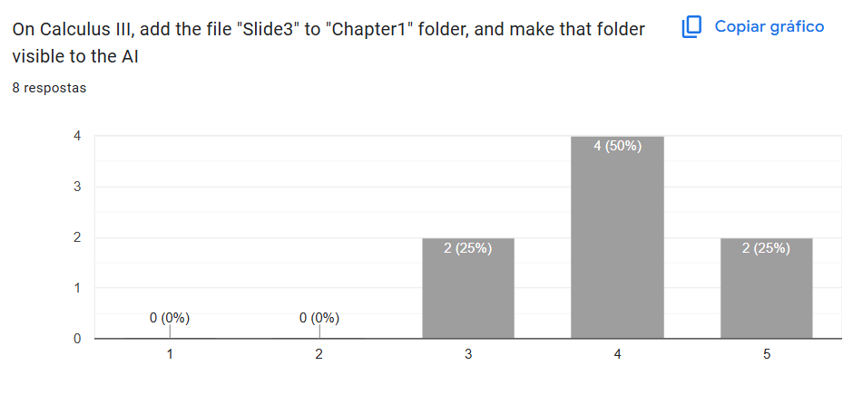

#### Task 2
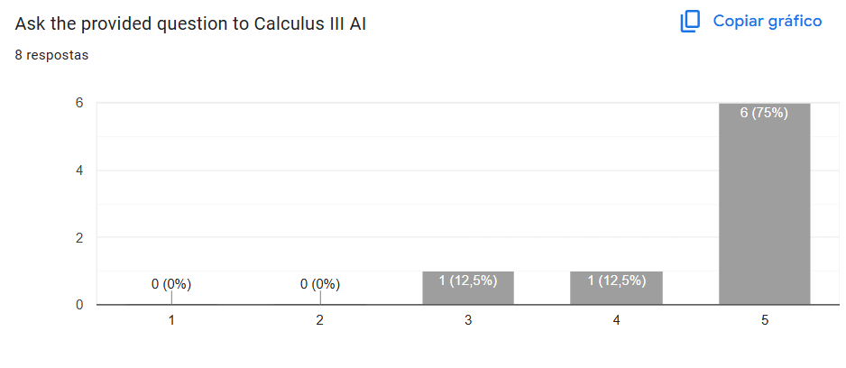

#### Task 3
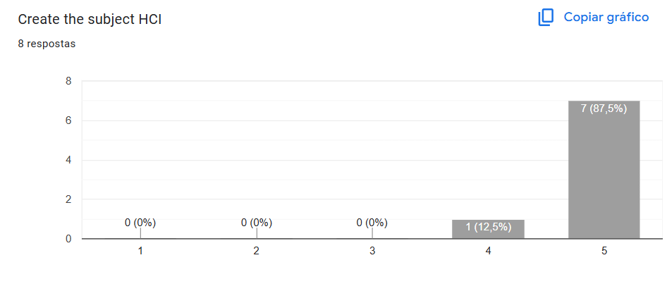

#### Task 4
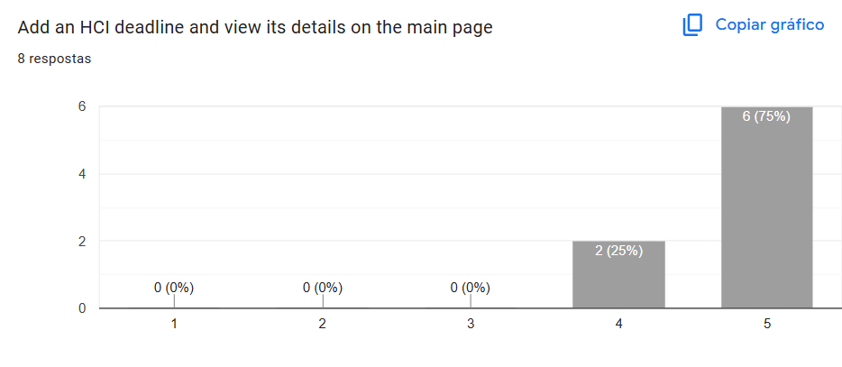

#### Task 5
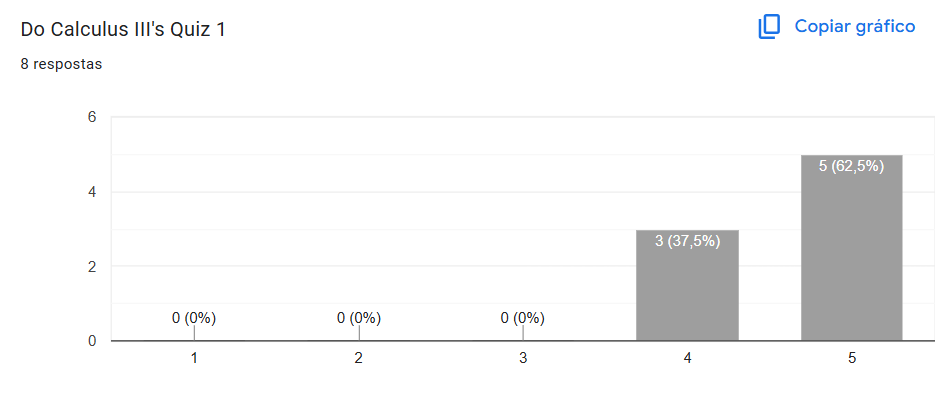

## The following screenshots show the results of the Observer's Table

### The answers use the terms that are specified in the graphics

#### Task Completion
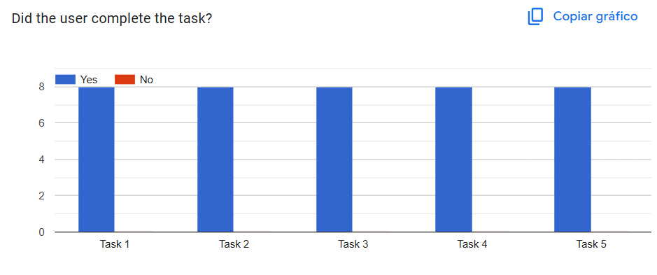

#### Number of Errors
        The number of errors being made int he first task shows that the files interface needed some tweaking.
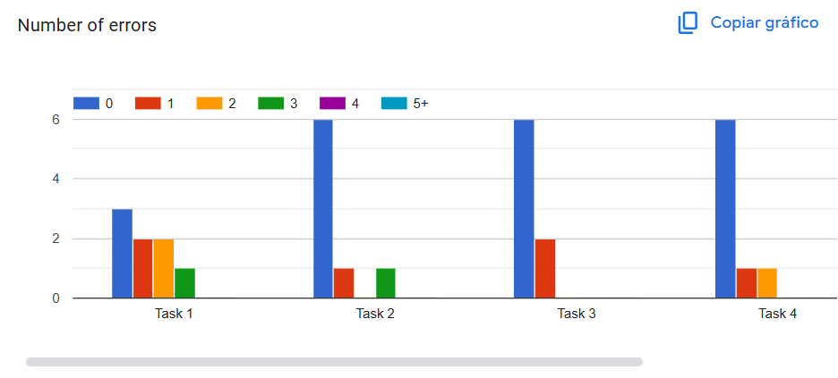
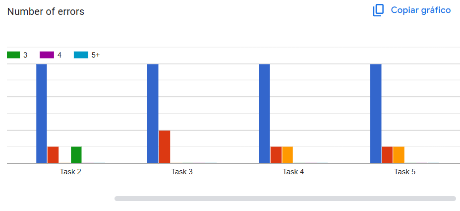

#### Was the user lost?
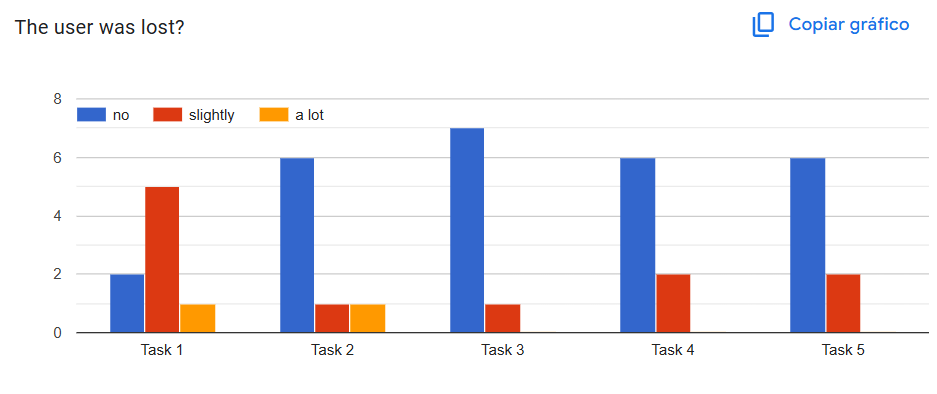

#### Did the user ask for help && help given
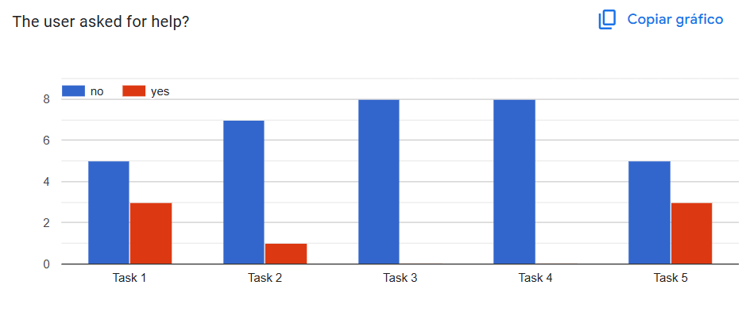

#### Observed Easiness
        This shows that the users mainly showed difficulty with the task related to the files.
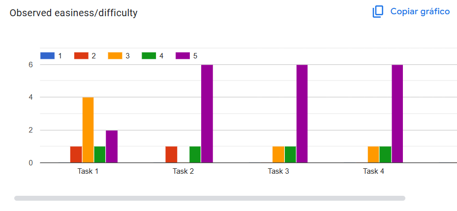
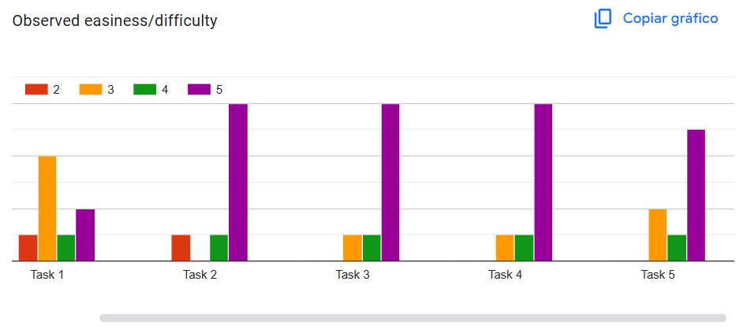

#### Time to complete tasks
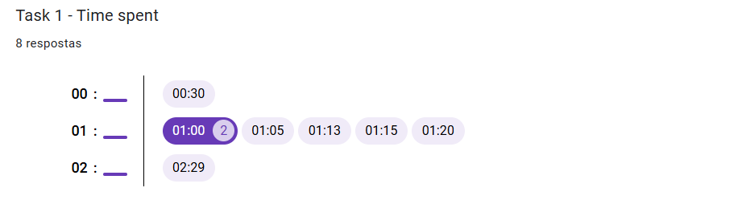
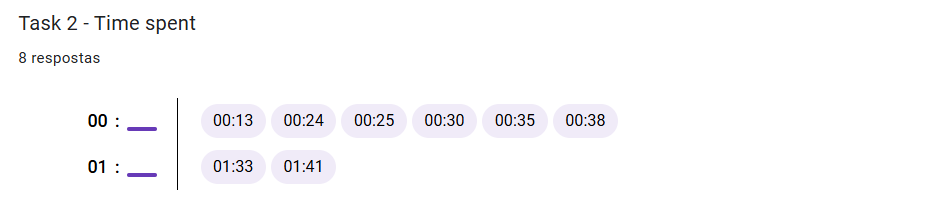
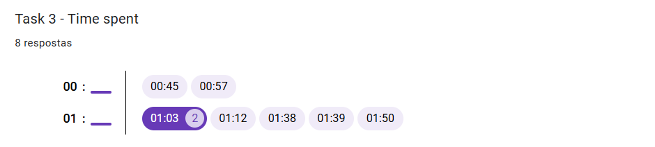
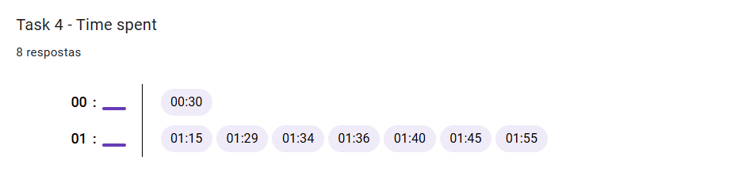
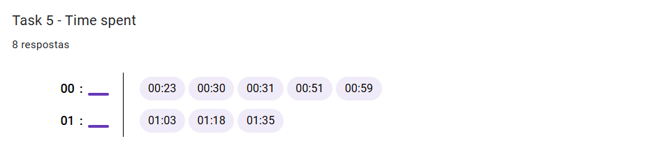

## The following screenshots show the results of the Post Task Questionnaire

### The answers use the terms that are specified in the graphics

#### User Info
        This shows that the prototype testers where all inside of our target audience, which gives us very accurate feedback to what the public would think of the finished product.
        We also asked for feedback from our practical class's Teacher, but it was done in an informal way so the information is not shown here.
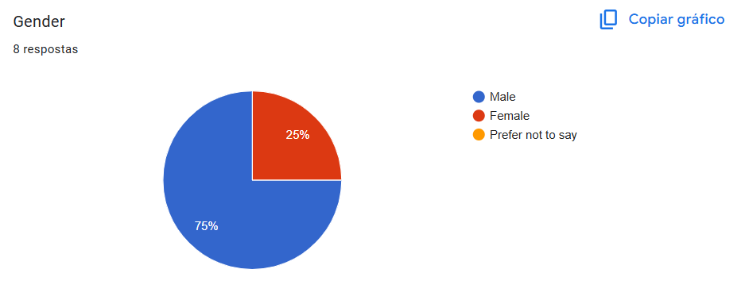
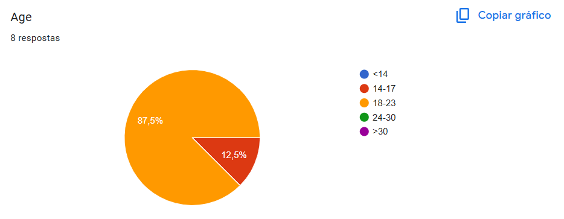
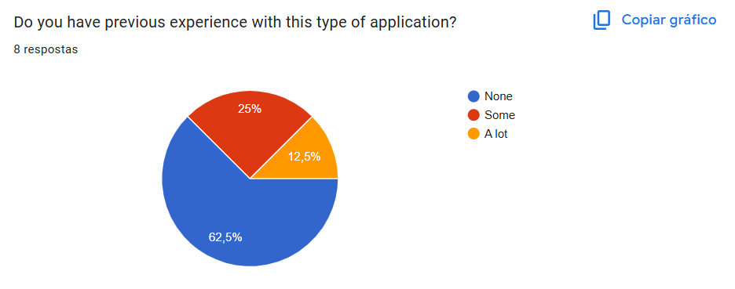
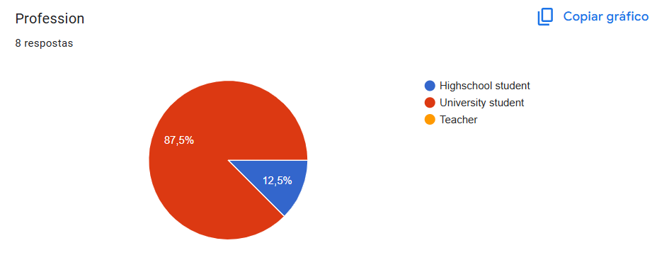

#### User Observations
        This feedback was taken into account in the next version of the prototype.
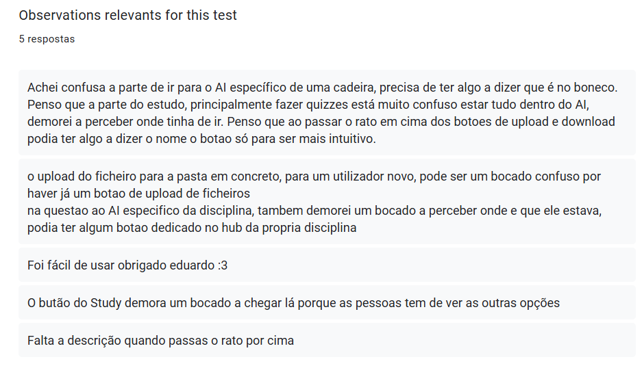

#### SUS
        There overall SUS score brings very promising results and we believe that by fixing some minor issues that were reported we will have a very stable and well built app.
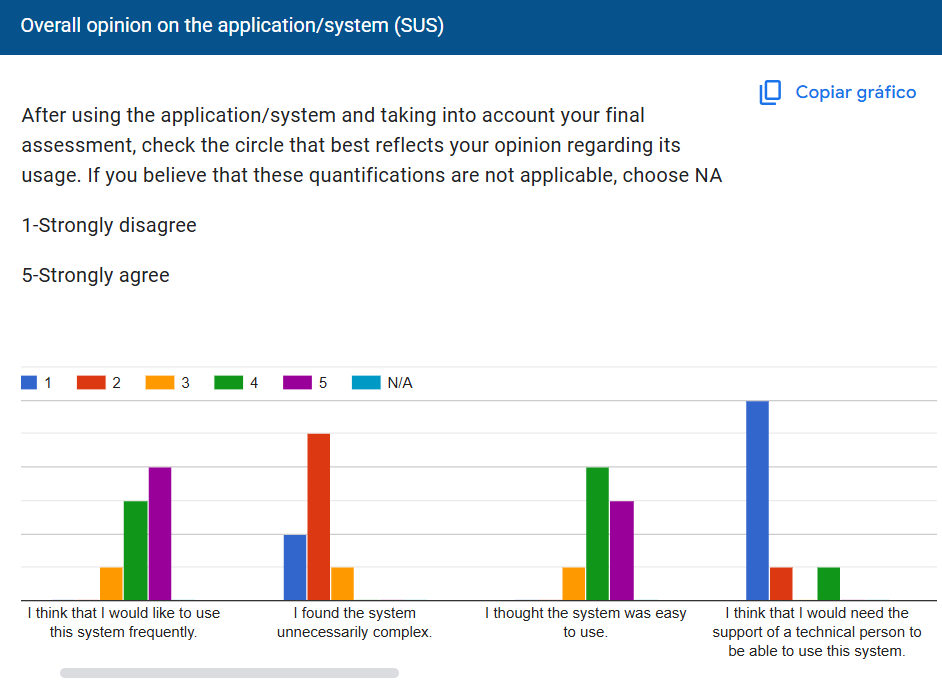
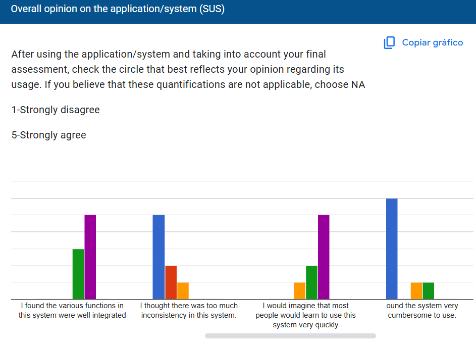
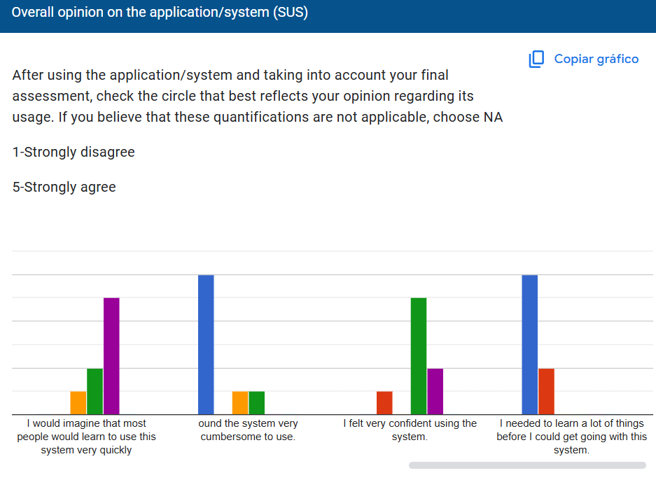

#### User Comments
        This feedback was taken into account in the next version of the prototype.
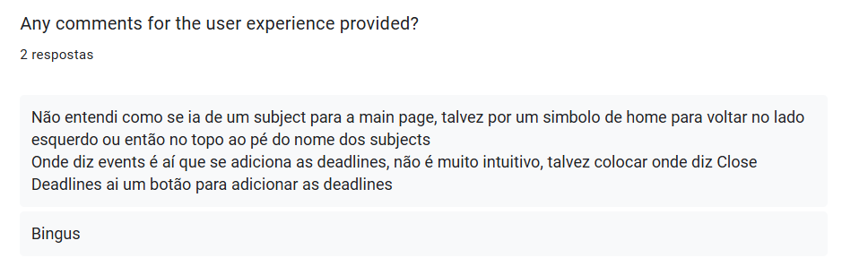

# Developer comments

## Tiago

        Since the feedback we have received is so positive, I believe our app can be turned into a proper project with a lot of people using it if it ever leaves the prototype phase.

## Eduardo

        (here)

## Daniel

        (here)

---
[Back to main Logbook Page](../hci_logbook.md)

---