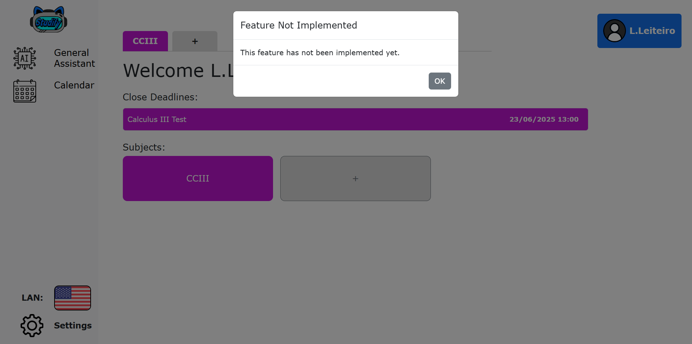

[Back to main Logbook Page](../hci_logbook.md)

---

# F. Discussion of Evaluation Results

        After scrapping the necessary parts of the low fidelity prototype, the feedback revolved more around some specific icons and how the users sometimes found the ways to get to some pages of the app confusing. The changes made are listed in the next topic.
        When taking these into account we made sure to take a more general approach to how we tackled those problems like using universaly known icons or chaning the UI in a way that would make it easier to understand.
        Some users also gve feedback about the "STUDY" button and how it was difficult for them at first to understand it was connected to the AI. We feel like this issue is not important due to the fact that users always got to the place they needed to go in the end and that the issue is more of around the fact that the AI mascot "Pixel" is supposed to show up the first time the user would log in and explain the basics while introducing himself as the user's AI assistant and how the AI systems work. Since this is not a situation that is present in the prototype, we talked with the users that manifested this difficulty around the "STUDY" button and they all agreed that it would indeed help them and that the UI around that button would be good as it was then.

# Refinement List

### - New Upload icon and description on hover

        The testers mentioned that the button for the upload files funtion wasn't very easy to understand so we decided to change the icon from the sometimes used "upload icon" (an upside down download icon) to a Plus sign (+) and got some positive feedback on the idea.
        We also got some feedback on the need of a description showing up when the user hovers a button related to file management, so we implemented an on-hover condition that triggers after aproximately 0.5 seconds of hovering time and shows a description of what that button does.

### - Modal for not implemented features

        Since we did a transition from a fully implemented low-fidelity prototype to a high-fidelity prototype that only implements the most important and necessary functions for the tasks given to the testers, we implemented a modal that appears when a button that would lead to a feature that isn't impelented yet so the testers would get lost in the UI and question why some buttons aren't working.
        This feature is present on every single button that isn't working yet, with the possibility of taking up this project again at a later time being on the table.

# Refined Prototype

## The Following screenshots show the changes mentioned previously

### - New Upload icon and description on hover

### - Modal for not implemented features

# Developer comments

## Tiago

        I believe that with these changes, the issues that potential users could have would more likely be related to personal preference or simply enviromental factors (for example, not paying attention at the first time they launch the app and skipping the "tutorials", not being used to using a computer, etc).

## Eduardo

        We tackled most of the issues our users reported, with the exception of improving the association made between the STUDY button and the AI and quizzes. Although this could be an issue when the user starts using the app, if we introduced the user to Studify with a small tutorial, guided by Pixel, users would understand the button’s functionalities.

## Daniel

        I think the feedback we received proved valuable for improving the clarity and usability of our prototype. Small refinements such as hoverable descriptions made a noticeable difference in the user's interaction with the website. If we were to resume the project in the future, we would have a solid foundation to build on, and we came to the conclusion that the current version of the prototype is much more user-friendly as a result of the adjustments we made.

---
[Back to main Logbook Page](../hci_logbook.md)

---